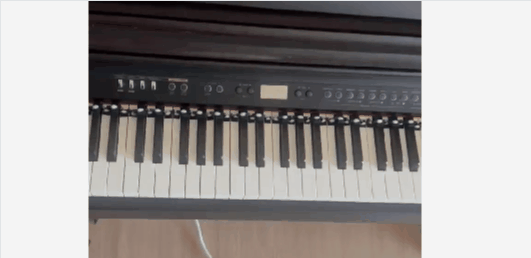
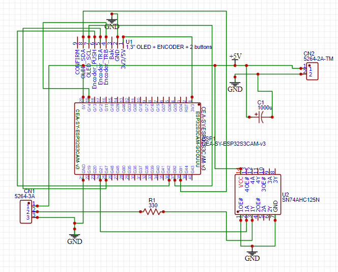

# 🎹 Led Piano Guide



ESP32-S3 CAM 보드와 네오픽셀(WS2812B)을 활용하여 피아노 연주(MIDI) 데이터를 실시간으로 시각화하는 완전 독립형(Stand-alone) 하드웨어 프로젝트입니다. 
별도의 프로그램 설치 없이 **전용 웹사이트에서 MIDI를 JSON으로 변환**하고, 보드에 **내장된 Micro SD 카드**에 저장하여 PC 연결 없이 외부 어댑터만으로 구동됩니다.

---

## ✨ 주요 기능

* **실시간 LED 매핑:** 88건반 피아노 연주를 1:1로 LED에 시각화
* **양손 구분:** 오른손(Red)과 왼손(Blue) 연주를 자동으로 분리하여 색상 표현
* **통합 UI 제어:** OLED & 로터리 인코더 일체형 모듈로 직관적인 곡 선택, 배속 조절(0.25x ~ 2.0x), 연주 구간 설정
* **논블로킹(Non-blocking) 재생:** 연주 도중 언제든 인코더 버튼을 눌러 즉시 재생 중단 가능
* **초간편 웹 변환기:** 브라우저에서 즉시 MIDI ➔ JSON 변환 (https://miditojson.netlify.app/)
* **PC Free (스탠드얼론):** 외부 5V SMPS 전원 하나로 보드와 LED를 동시 구동


---

## 📐 시스템 아키텍처

```text
┌────────────────────────────────────────────────────────┐
│                   MIDI File (.mid)                     │
└───────────────────────────┬────────────────────────────┘
                            │
                            ▼ (Web Converter / 브라우저 단독 연산)
┌────────────────────────────────────────────────────────┐
│                Lightweight JSON (.json)                │
└───────────────────────────┬────────────────────────────┘
                            │
                            ▼ (Micro SD Card 장착)
┌───────────────────────────────────────────┐      ┌───────────────────────────┐
│               ESP32-S3 CAM                │◄────►│     1.3" OLED Display     │
│                                           │      │   & Rotary Encoder UI     │
└─────────────────────┬─────────────────────┘      └───────────────────────────┘
                      │
                      ▼ (3.3V ➔ 5V Level Shift: 74AHC125N)
┌────────────────────────────────────────────────────────┐
│       88-Key WS2812B NeoPixel Strip (1:1 Mapping)      │
└────────────────────────────────────────────────────────┘
```

---

## 🛠️ 하드웨어 구성 요소
* **MCU:** ESP32-S3 CAM 보드 (8MB 이상 PSRAM 및 Micro SD 슬롯 내장 필수)
* **UI Module:** OLED & 로터리 인코더 일체형 콤보 모듈 (1.3인치 SH1106 I2C + 인코더 통합형)
* **LED:** WS2812B NeoPixel Strip - 30mm spacing `(※ 각 건반 위에 직접 부착 가능하도록 LED 간 일정한 간격을 둔 스트립 사용을 권장합니다.)`
* **Level Shifter:** SN74AHC125N (3.3V ➔ 5V 로직 레벨 변환)
* **Power:** 5V SMPS (MCU 및 네오픽셀 통합 전원 공급용)
* **보호소자:** 330Ω 저항 1개, 1000uF 전해 캐패시터 1개

### 🔌 스탠드얼론 배선 가이드 (Wiring Diagram)

| 부품명 | 부품 핀 (실크스크린) | 연결 대상 (ESP32-S3 CAM 및 기타) | 비고 |
| :--- | :--- | :--- | :--- |
| **ESP32-S3 CAM** | `5V` (또는 VIN) | SMPS 5V (+) 출력 | 메인 보드 전원 공급 |
| (메인 MCU) | `GND` | SMPS GND (-) 및 공통 접지 | |
| **1.3" OLED + Encoder** | `3V3` (VCC) | ESP32-S3 CAM **3.3V 핀** | 데이터시트 권장 전압 (3.3V 직결) |
| (일체형 콤보 모듈) | `GND` | 공통 GND | |
| | `OLED_SDA` | ESP32-S3 CAM **GPIO 1** | I2C 통신 데이터 (안전 핀) |
| | `OLED_SCL` | ESP32-S3 CAM **GPIO 2** | I2C 통신 클럭 (안전 핀) |
| | `ENCODER_TRA` | ESP32-S3 CAM **GPIO 47** | 인코더 회전 감지 A상 |
| | `ENCODER_TRB` | ESP32-S3 CAM **GPIO 14** | 인코더 회전 감지 B상 |
| | `ENCODER_PUSH` | ESP32-S3 CAM **GPIO 42** | 인코더 스위치(클릭) 감지 |
| | `CONFIRM` / `BAK` | **연결 안 함 (N.C)** | 현재 펌웨어에서는 미사용 |
| **74AHC125N** | Pin 1 (`1OE`) | 공통 GND | Active Low 활성화 (GND 고정 필수) |
| (3.3V ➔ 5V 레벨시프터) | Pin 2 (`1A`) | ESP32-S3 CAM **GPIO 21** | 3.3V 데이터 입력 (신호원) |
| | Pin 3 (`1Y`) | **330Ω 저항 한쪽 다리** | 5V 승압 데이터 출력 |
| | Pin 7 (`GND`) | 공통 GND | 칩 접지 |
| | Pin 14 (`VCC`) | SMPS 5V (+) | 칩 구동 전원 |
| **WS2812B 네오픽셀** | `DIN` (DI) | **330Ω 저항 반대쪽 다리** | 레벨시프터 3번 핀에서 ➔ 저항 ➔ `DIN` 순서 직렬 연결 |
| (88건반 페블형 스트립) | `5V` | SMPS 5V (+) | 고전류용 두꺼운 전선 권장 |
| | `GND` | 공통 GND | |
| **Micro SD 카드** | Built-in (내장 슬롯) | ESP32-S3 CAM 내부 연결 | 별도 배선 불필요 (SD_MMC 1-Bit 모드 자동 연동) |



---

## 📦 의존성 및 라이브러리 (Dependencies)

Arduino IDE의 **라이브러리 매니저**에서 아래 항목들을 검색하여 설치해야 합니다.

* `U8g2` (by oliver) - OLED 디스플레이 제어
* `FastLED` (by Daniel Garcia) - 네오픽셀 제어
* `ArduinoJson` (by Benoit Blanchon) - 대용량 JSON 파일 파싱

---

## ⚙️ 시스템 설정 및 컴파일 가이드

대용량 JSON 파일 파싱을 위해 PSRAM을 적극적으로 사용하므로, **Arduino IDE 2.x**에서 아래 설정이 정확히 일치해야 메모리 에러가 발생하지 않습니다.

### 1. 보드 설정 (Tools 메뉴)
* **Board:** `ESP32S3 Dev Module`
* **Flash Size:** `8MB (64Mb)` 이상
* **PSRAM:** `OPI PSRAM` *(활성화 필수, 보드 스펙에 따라 QSPI일 수 있음)*
* **USB CDC On Boot:** `Enabled`

---

## 🚀 사용 방법 (How to Use)

### Step 1. MIDI 데이터 웹 변환
1. 스마트폰이나 PC에서 전용 변환기 웹사이트에 접속합니다: [https://miditojson.netlify.app/](https://miditojson.netlify.app/)
2. `MIDI 파일 선택하기` 버튼을 눌러 원하는 곡(.mid)을 업로드합니다.
3. 브라우저에서 양손 분리 및 최적화가 완료된 `.json` 파일이 즉시 다운로드됩니다. (※ SD 카드 인식 및 OLED 메뉴 표시를 위해 영문 파일명 권장, 예: Summer.json)

### Step 2. Micro SD 카드 세팅
1. Micro SD 카드를 PC에 연결하고 반드시 **`FAT32`** 방식으로 포맷합니다.
2. SD 카드 최상단 경로에 **`json_files`** 라는 이름의 새 폴더를 만듭니다.
3. 변환된 `.json` 파일들을 해당 폴더 안에 모두 복사합니다.

### Step 3. 스탠드얼론 하드웨어 구동
1. 초기 1회만 PC와 USB로 연결하여 코드를 업로드합니다.
2. 곡이 담긴 Micro SD 카드를 ESP32-S3 CAM 보드 뒷면 슬롯에 장착합니다.
3. USB 선을 뽑고, **외부 5V SMPS 전원**을 인가합니다.
4. 독립적으로 시스템이 부팅되면 인코더 다이얼을 돌려 곡을 선택하고 화려한 연주 시각화를 감상합니다!

---

## 📂 소스 코드 및 파일 안내 (Appendix)
* 웹 변환기 소스: `index.html` (프론트엔드 파싱 로직 전체)
* ESP32 펌웨어 (88건반용): `esp32s3_cam_for_88keys.ino`
* ESP32 펌웨어 (61건반용): `esp32s3_cam_for_61keys.ino`  
(※ 사용하시는 건반 수에 맞는 코드를 컴파일하세요. 첫 번째 LED가 각 건반의 가장 낮은 음에 매핑됩니다.)

📄 **웹 변환기 출력 JSON 데이터 구조 예시**  
메모리 최적화를 위해 타임스탬프(t) 기준으로 이벤트가 병합되며, 키값이 짧게(n, p, h) 축약되어 출력됩니다.
```json
{
  "metadata": {"title":"river_flows_in_you", "bpm":65},
  "timeline": [
    {
      "t": 0.0,
      "n": [{"p":81, "h":"r"}, {"p":54, "h":"l"}]
    }
  ]
}
```

---
## ⚡ 엔지니어링 최적화 포인트 (Engineering Highlights)
* **메모리 및 연산 최적화:** 표준 MIDI의 복잡한 청크 데이터를 타임스탬프(t), 음계(p), 손 구분(h)의 경량 JSON 포맷으로 전처리하여 ESP32 내부 파싱 부하 및 지연시간(Latency) 최소화
* **신호 무결성 확보:** ESP32-S3의 3.3V GPIO 신호를 5V 고속 버퍼 IC(74AHC125N)와 330Ω 댐핑 저항을 거쳐 800kHz WS2812B 구동 데이터 왜곡 및 반사파(Ringing) 방지
* **전원 안정성 설계:** 대량 LED 점등 시 발생하는 순간 전압 강하(Voltage Sag)를 방지하기 위해 전원단에 1000uF 벌크 캐패시터를 배치하여 MCU 브라운아웃(Brownout) 방어
